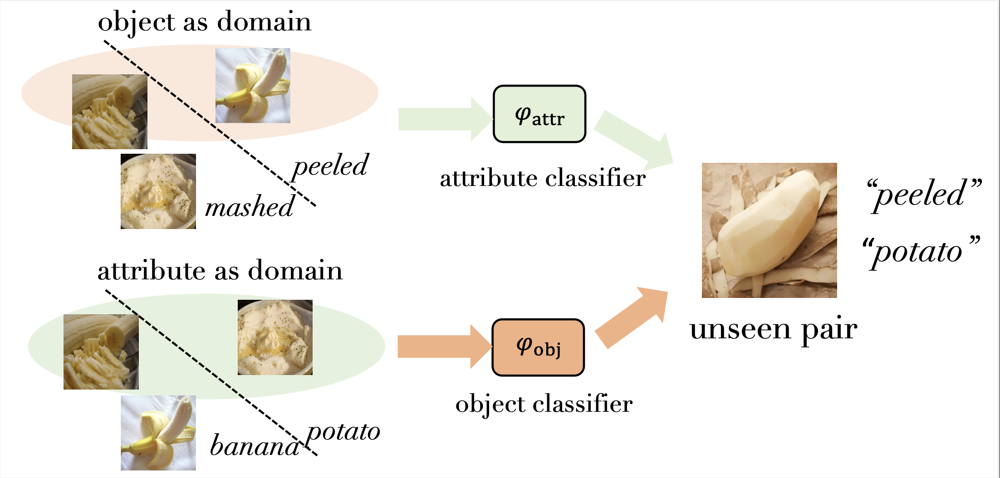

# Learning Invariant Visual Representations for CZSL

This repository provides dataset splits and code for Paper:

Learning Invariant Visual Representations for Compositional Zero-Shot Learning, ECCV 2022 [Paper (arXiv)](https://arxiv.org/pdf/2206.00415.pdf)


<p align="center">
  
</p>

We reconsider CZSL as an out-of-distribution generalization problem to improve the ability of the model to generalize to unknown compositions. If an object is treated as a domain, we can learn object-invariant features to recognize the attributes attached to any object reliably. Similarly, attribute-invariant features can also be learned when recognizing the objects with attributes as domains. By penalizing domain-specific power of features, we discover invariant mechanisms in the data which are hard to vary across examples and thus learn the optimal attribute classifier and object classifier. 


## Usage 

1. Clone the repo.

2. We recommend using Anaconda for environment setup. To create the environment and activate it, please run:
```
    conda env create --file environment.yml
    conda activate czsl
```

3. The dataset and splits can be downloaded from: [CZSL-dataset](https://drive.google.com/drive/folders/1ZSw4uL8bjxKxBhrEFVeG3rgewDyDVIWj).


4. To run IVR for UT-Zappos dataset:
```
    Training:
    python train.py --config config/zappos.yml

    Testing:
    python test.py --logpath LOG_DIR
```


**Note:** Most of the code is an improvement based on https://github.com/ExplainableML/czsl.

## References
If you find this paper useful in your research, please consider citing:
```
@inproceedings{zhang2022learning,
  title={Learning Invariant Visual Representations for Compositional Zero-Shot Learning},
  author={Zhang, Tian and Liang, Kongming and Du, Ruoyi and Sun, Xian and Ma, Zhanyu and Guo, Jun},
  booktitle={ECCV},
  year={2022}
}
```
